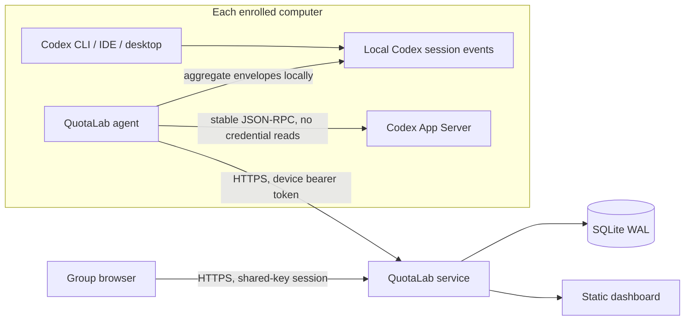

# Architecture

## System map

The agent is deliberately independent of Codex launch commands. This avoids
per-surface wrappers and means one installation observes CLI, IDE, and desktop
events written under the same Codex home.

## Workspace layout

- `packages/contracts`: Zod request schemas and shared response types.
- `apps/server`: Fastify HTTP service, SQLite repository, authentication,
  aggregation, attribution, static dashboard hosting, and CSV export.
- `apps/agent`: cross-platform CLI, App Server client, incremental privacy-safe
  session scanner, durable cursor state, and ingestion loop.
- `apps/web`: React/Vite dashboard and browser end-to-end tests.

## Enrollment and authentication

1. A group creator chooses a name and a high-entropy shared key.
2. The service generates an opaque group slug and stores only an scrypt hash of
   the key.
3. A browser exchanges the group slug/key for a short-lived opaque HttpOnly
   session. A device exchanges them plus a persistent random device UUID for a
   revocable random device token.
4. Only token hashes are stored. The group key is not retained by the agent
   after enrollment.

No Codex identity or credential is used as QuotaLab authentication.

## Ingestion

Every batch has a UUID and is inserted transactionally. Duplicate batch and
sample IDs are ignored. An ingestion contains:

- official quota bucket snapshots and account-level numeric usage summary;
- local numeric usage slices keyed by a one-way session hash;
- current network identity (MAC only for an unnamed device);
- scanner health counts, never raw malformed lines.

SQLite uses WAL mode, foreign keys, bounded busy timeout, and additive schema
migrations. One service process owns the database file.

## Incremental local scanner

The agent stores byte offsets and minimal numeric parser state in its own user
configuration directory. Files are opened with shared-read semantics so active
Codex clients are not interrupted. It advances only past complete newline-
terminated JSON records and handles truncation as a new stream.

For each token update it computes a monotonic delta from cumulative totals. The
coarse purpose vector is constructed locally:

- context: input tokens;
- reasoning: reasoning-output tokens;
- code, tools, conversation: non-reasoning output apportioned by the byte
  lengths of locally observed file-change, tool-call, and message envelopes.

The vector sums to the measured total token delta. Byte lengths and counts are
discarded after aggregation; event text is never sent.

## Quota attribution

For one quota bucket/reset cycle, canonical official snapshots are ordered by
observation time. Each positive `usedPercent` delta is apportioned across local
token samples in the same interval. No matching sample produces an unattributed
segment. The first observed percentage is attributable only when observation
starts near the window boundary; otherwise it stays unattributed.

Attribution is computed from immutable observations when a dashboard is read,
so late idempotent device batches can improve a prior estimate. Negative deltas,
stale snapshots, and reset changes never subtract usage from a device.

## API boundaries

Public:

- `GET /api/health`
- `POST /api/groups`
- `POST /api/session`
- `POST /api/agent/enroll`

Browser session:

- `GET /api/dashboard`
- `GET /api/devices/:id`
- `PATCH /api/devices/:id`
- `GET /api/export.csv`
- `DELETE /api/session`

Device bearer token:

- `POST /api/agent/ingest`
- `GET /api/agent/status`

All error responses use stable machine codes plus user-actionable messages.
Authentication failures intentionally do not reveal whether a group exists.
